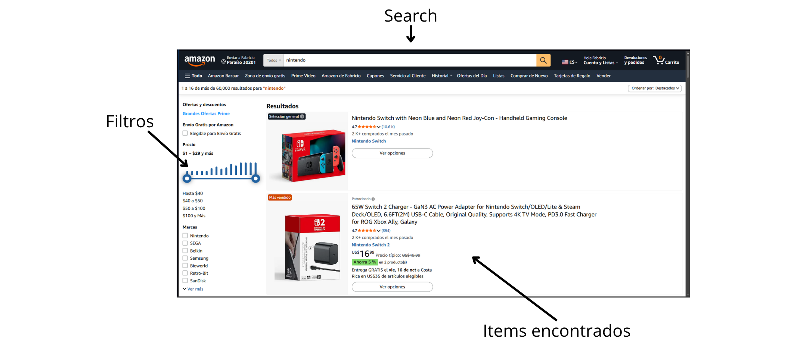
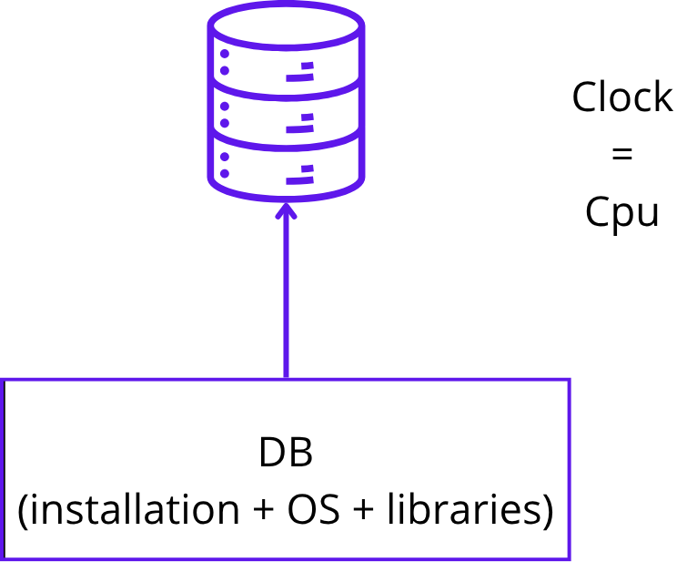
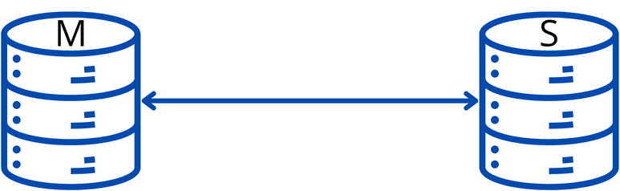
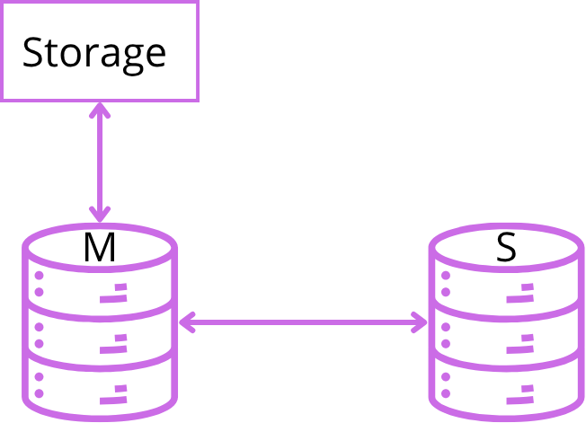
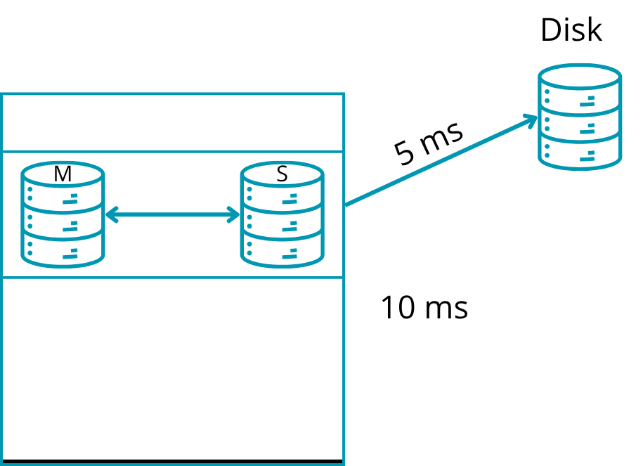
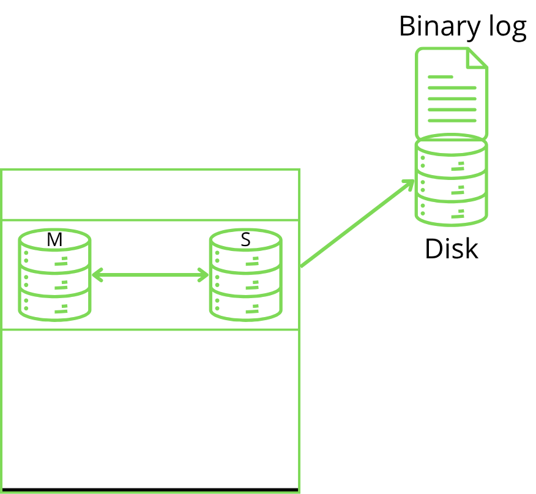
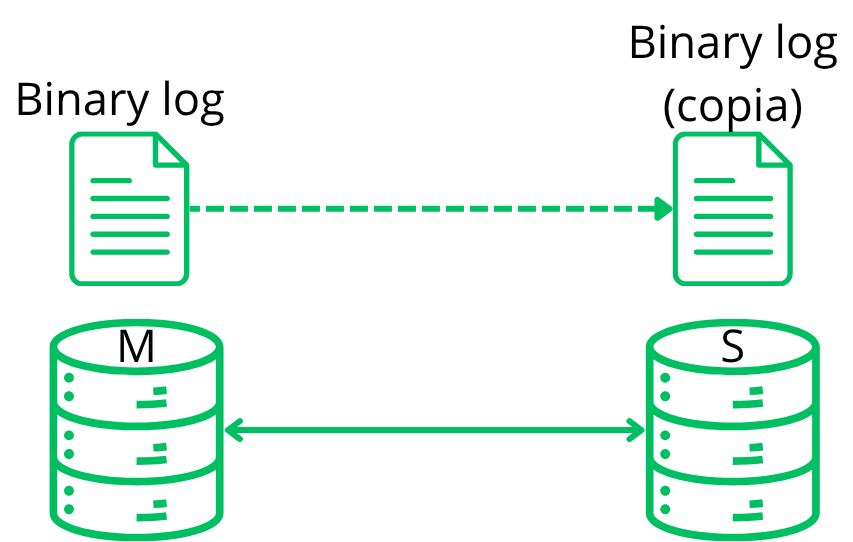

# Bases de datos II - Apuntes de Clase

### Fecha: 6/10/2026

## Temas a tratar

- Proyecto 2
- Arquitecturas de replicación

## Proyecto 2

- Se menciona que a nivel de dificultad puede ser considerado más sencillo que el proyecto 1

- Valor: 30%

### Objetivo:

- Se debe crear una API REST para crawling de páginas variadas para obtener los datos de estas. El usuario debe poder hacer búsquedas con facetas (funcionan como filtros en páginas de tiendas) y autocompletado. Se debe usar una biblioteca de Python para obtener entidades. El proyecto incluye el uso de ElasticSearch y de Mongo DB Atlas.

### Datos generales:

- Nombre del proyecto: Smart Search
- Los demás datos generales se mantienen iguales al proyecto 1

### Descripción:

- Mongo DB Atlas da una base en el free tier, cuenta con el almacenamiento necesario para el proyecto. Además Mongo DB Atlas utiliza índices como Elasticsearch.

### Arquitectura para el proyecto.

- Uso de Vercel.
- Cloud Firestore para usuarios y config key-value.
- Se utiliza un disco persistente, conectado con Spacy Entity Extractor y con el API Crawler
- RabbitMQ debe conectarse con la API Crawler, el controller y a Spacy entity extractor.
- Spark se conecta con Spacy entity extractor, disco persistente y Mongo DB Atlas.

### Dataset

- El grupo de trabajo se encarga de seleccionar un dataset HTML usando: Selenium, que se encarga de recolectar el archivo en HTML de las páginas.
- La navegación es específica del dataset.
- Para la selección del dataset se debe exponer: descripción, título, precio, categorías (al menos 3 diferentes), fechas e imágenes.
- Se debe documentar el dataset raw.

### API Crawler

- Usa Selenium.
- Descarga los archivos y los almacena en una carpeta "raw".
- Usa Beautiful Soup para obtener los datos del HTML. 
- A partir de los datos obtenidos de Beautiful Soup se llena un JSON. Se debe recordar que este proceso depende de la estructura de cada sitio web.
- El sistema debe usar un disco compartido tipo Read/Write Many. La definición del disco está en la tarea 2.

### Spacy Entity Extractor

- Los mensajes de la API los lee Spacy.
- Genera un diccionario de Python. Los datos se utilizan para llenar el JSON.

### SPARK Processor

- Los nombres de personas como "Apellido, Nombre".
- Las entidades inician con Mayúscula.
- Las categorías tienen cada primera letra en mayúscula y se debe remover los espacios en blanco al inicio o fin.
- Descripciones limitas, con max 128 char.

### Mongo DB Atlas

- Se debe definir un mapping para la base de datos.
- Darle información "especial" para facetos.
- Highlighting: entrega coincidencias entre búsqueda y texto.
- Para crear el search index se debe definir el JSON, esto se puede hacer desde la web de Mongo DB Atlas.
- Se deben justificar los campos escogidos.
- Para conectarse a Mongo DB Atlas, ir a la sección de Proyecto y configurar los apartados de Databases Access (usuarios) y de Network Access (IPs).

### REST API Node JS

- Utilizando Vercel o Supabase. (Plataformas para desarrollo)
- Se conecta a Mongo DB Atlas Search y a Cloud Firestore.
- Escoger seguridad y autenticación. Se puede usar Firebase (gratuito) para el apartado de autenticación. Firebase permite agregar usuarios o se pueden agregar dinámicamente.

### UI

La UI debe cumplir con:

- Registro.
- Sesiones.
- Buscar y filtrar ítems / docs.
- Diseño a criterio del grupo.

- Los filtros se generan desde la base de datos, no en API REST o UI.
- Usar IA para UI.

### Automatización

- Automatizar en Kubernetes y Helm Charts
- Los componentes API Crawler, Controller y Spacy Entity Extractor se implementan como pods
- El componente Spark Processor Job deberá ser implementado como un CronJob de Kubernetes
- El disco compartido deberá ser implementado como un Persistent Volume de Kubernetes.
- MongoDB Atlas, Google Cloud Firestore y Vercel cuentan con versiones gratuitas
- La configuración debe ser inyectada mediante variables de entorno.

Para el proyecto no se proporciona un proyecto base

### Observabilidad

- Los componentes de la solución deben estar monitoreados con Prometheus
- Mongo DB Atlas puede ser complicado.
- Se deben proporcionar dashboards en Grafana para todos los componentes de la solución

- No usar prints, usar logging en Python

## Arquitecturas de replicación

Son sistemas para manterer los datos de manera persistente y confiable en bases de datos, se implementan al haber más de una isntancia de las bases. Se basan en utilizar un archivo para añadir las operaciones antes de procesarlas en la base, de modo que en caso de perder acceso o datos, se puedan recrear estos mediante la ejecución de las operaciones sin realizar.

Varias bases usan un sistema muy parecido al sistema qe implementa PostgreSQL pero con otros nombres. Ej:

`Write-Ahead-Lock (WAL) = Binary Log = Log Shipping`

### Base de datos simple / única

- Hay un solo reloj, el cual es el CPU, este se encarga de coordinar todo.

- En los sistemas de una sola base de datos no hay red de comunicación.

Al cambiar de una base de datos única a un sistema distribuido se pueden encontrar problemas referentes a la persistencia de datos y a la posible perdida de entradas cuando las bases de datos o las bases de datos de escritura no están disponibles.

### Teniendo 2 servidores:

Tienen varios nombres como `master-slave`. En estos casos:

- El master recibe lecturas y escrituras.

- El slave se mantiene en Standby o warm (no acepta escrituras o lecturas). Además el slave se mantiene en estado Recovery Mode.

Recordando lo dicho en ACID, un cambio en una db debe ser guardado o debe almacenarse persistentemente. Además las base de datos deben asegurar que los datos son correctos y solo después de asegurar esto guardan la información.

#### En bases SQL:

Lectura de la imagen:

- Hay 10 milisegundos de delay para asegurar que los datos funcionan o son correctos.
- Hay 5 milisegundos de delay para escritura.

Además para realizar modificaciones el sistema tiene acceso aleatorio a memoria, por lo que se tarda más en encontrar el sector. Esto ya que se puede estar cerca o no del dato que se desea alterar. Por otro lado en las bases de datos basadas en timeseries es más rápido pues solo se debe hacer un append al final. Ya que cada entrada es única y nueva, no se modfican entradas anteriores.

### Protocolos de escritura

La base usa un protocolo de escritura:

- En estos casos al crear operaciones en la base, se /guarda primero la operación en el Binary Log antes de ejecutar la operación o revisar los datos.
- Cada dato tiene un Log Sequence Number (LNS) el cual funciona como índice.

### Modo Recovery

- Cuando la base de datos detecta un desfase entre el Binary Log y los datos de la base, entra en modo Recovery ( no permite escrituras o lecturas / No R&W), y después de entrar en este modo se ejecutan las operaciones que no se ejecutaron previo al desfase en memoria.
- La base de datos hace un dump en disco cada cierto tiempo. Los datos pasan de RAM a disco.
- Cuando se envían los datos a disco, la base va al Binary log y añade un checkpoint en el último log de operaciones.

### Write Ahead Log <-> Log Shipping

Es un sistema en el cual en vez de copiar todos los datos, se envían los Binary logs en la red y las demás bases, que se encuentran en recovery mode, se encargan de ejecutar las operaciones.

#### Real time

- Se refiere a que cada cambio u operación que llega a la base de datos se envía inmediatamanete a las demás.
- No es tan probable que se pierdan datos pues cada operación es duplicada.
- Suele ser más costoso.

#### Asíncrono

- En este caso se obta por enviar cada X tiempo.
- Se acepta que exista una cantidad de tiempo que se pueden perder datos.
- Es menos Costoso que usar Write Ahead Log en Real Time.

#### Extra

- Se recuerda que la próxima clase es asincrónica (9/10/2026).
- Se menciona el paso de las clases de la semana de Festec a virtuales.
- Se pasa la entrega de la segunda tarea para el lunes 12 de octubre, se mantiene la revisión el 13 de octubre
